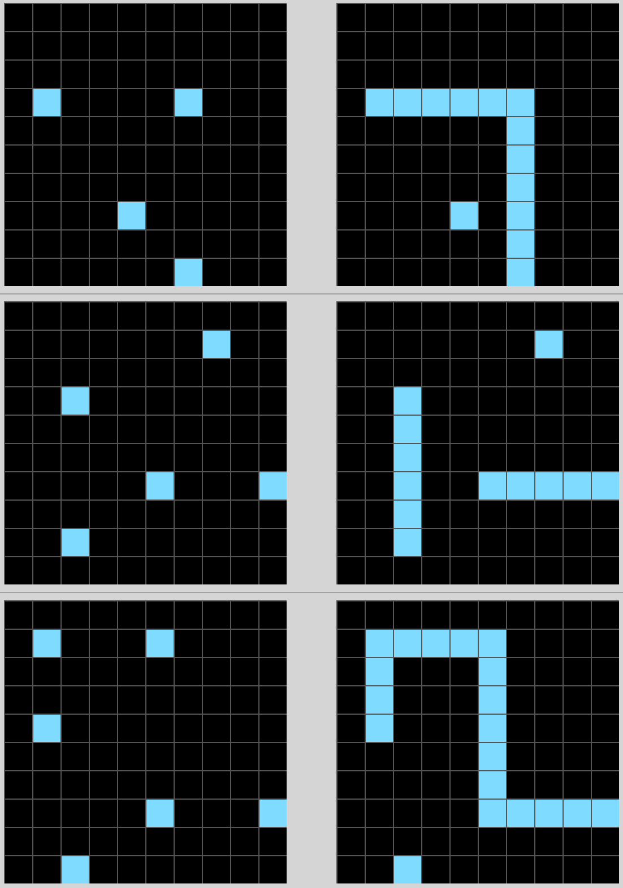
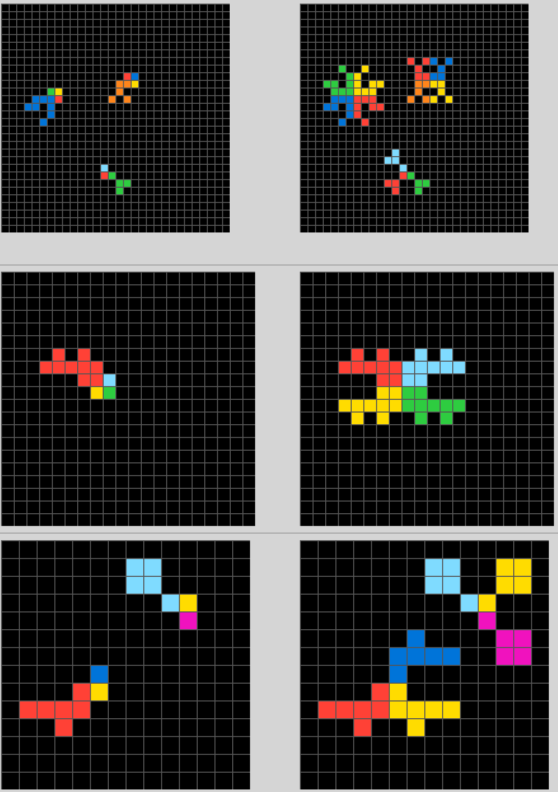
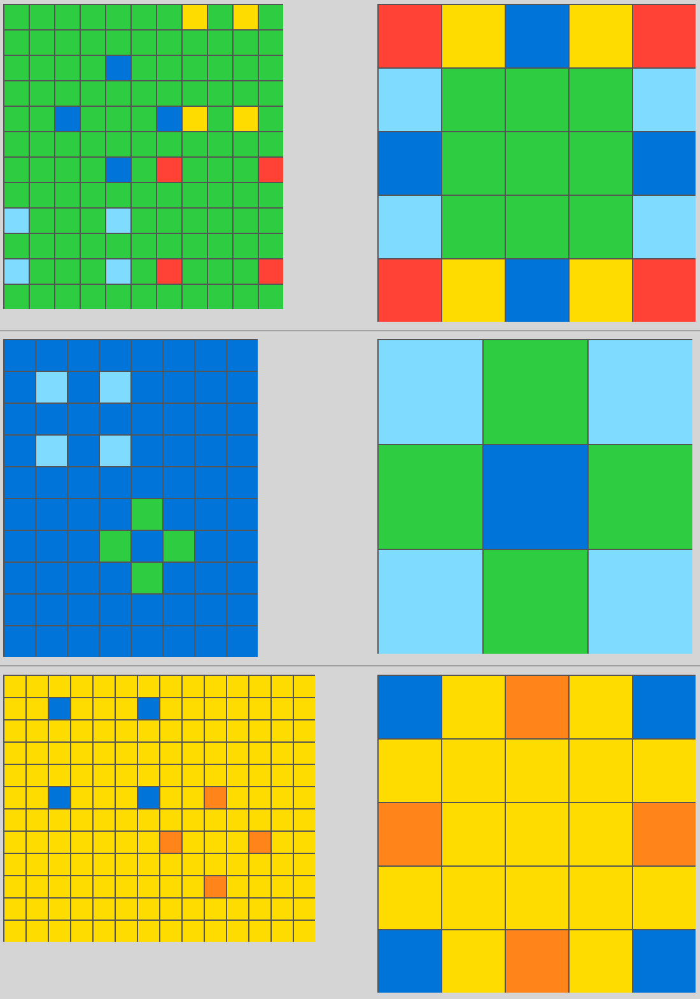

# CT5148 - Programming and Tools for Artificial Intelligence (Assignement 3)

On "The Measure of Intelligence", Chollet proposed a new benchmark for AI agents with high capacity of generalization. The benchmark is comprised of tasks like the ones used to measure IQ in humans. Each task contains a few examples of how it is supposed to be performed and one test task that needs to be solved by the agent. This dataset challenges the current state of AI research which is based on data hungry machine learning methods. Although machine learning has been very successful at solving hard problems in many areas, it is still very far away of the AI dream of building artificial human level intelligence.

The ARC challenge assumes that an artificial agent has the following core knowledge priors:
- Objectness priors: The agent can recognize objects, know how separate object from noise and perceive that objects interact with each other.
- Numbers and counting priors: The agent can count objects, sort objects by size, can determine which ones appears with high/low frequency and which object is the largest or smallest.
- Basic geometry and topology prior: The agent can recognize basic shapes, symmetry, draw lines, scale objects up and down, copy and repeat objects and understanding relationships such as contains, is contained, outside perimeter etc.

ARC is hard for mains stream AI methods because the agent needs to reason about the problem at hand rather than rely only on it's pior knowlage of previous tasks. Each new task is surprising and unique and each example shows very different scenarios. In contrast, this tasks are relatively easy for humans to solve.

## Hand-coded Solutions

The objective of this assignment is to solve three of the ARC tasks by programming a hand-coded solution for them. These are the tasks I chose:

### Task ded97339

The objective of this task is to draw a straight line between the blocks in a grid, when possible. Based on the examples we can observe that we are able to draw a line everytime two or more blocks appears in the same row or column.

This task requires the gemotry and topology priors.

### Task b775ac94

The objective of this task is to mirror the large structures based on the position and color of the less common blocks.

This task requires objectness, counting prior and geometry, and topology priors.

### Task c8cbb738

The objective of this task is to identify and reassemble the objects such that they fit each other.

This task requires objectness, counting prior and geometry, and topology priors.

## The Abstraction and Reasoning Corpus (ARC) Repository

More information about ARC can be found in the [original repositoy](https://github.com/fchollet/ARC).
